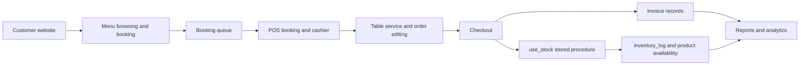

# VNT Restaurant

Full-stack restaurant website and POS/back-office management system built with Laravel for a multi-branch F&B business.

<p align="center">
  
  
</p>

## Overview

This project is not a generic Laravel starter. It models the day-to-day operation of a restaurant business from customer discovery to booking, table service, checkout, stock movement, staff operations, and reporting.

The product combines two interfaces in one codebase:

- A customer-facing website for menu browsing, branch discovery, contact, news, and table booking
- A branch-aware POS/back-office interface for cashier, operations, inventory, staffing, permissions, and analytics

## What This Repo Demonstrates

- End-to-end business workflow design for a restaurant/POS-like product
- Full-stack implementation with Laravel, Blade, Vanilla JavaScript, MySQL, and Vite
- Real operational modules instead of isolated CRUD pages
- Database-level business logic with triggers, views, and stored procedures
- Role-based internal tooling for different staff responsibilities

## Product Modules

| Module | Main routes | What it covers |
| --- | --- | --- |
| Customer website | `/`, `/menu`, `/location`, `/news`, `/contact`, `/booking` | Brand site, searchable menu, branch information, contact intake, and table booking with pre-order support |
| POS login and dashboard | `/pos/login`, `/pos/kiot` | Branch login, daily revenue snapshot, completed orders, active tables, and dashboard charts |
| Cashier flow | `/pos/cashier`, `/pos/invoice` | Table service, order building, discount/promotion handling, payment methods, and invoice history |
| Reservation management | `/pos/booking` | Booking queue, table assignment, booking detail, receive/cancel flow, and pre-ordered items |
| Menu and promotions | `/pos/product`, `/pos/promotion` | Product catalog, categories, pricing, and promotional campaigns |
| Multi-branch operations | `/pos/location`, `/pos/regions`, `/pos/table` | Branches, areas, regions, tables, status control, and operational mapping |
| Inventory and recipe logic | `/pos/ingredient`, `/pos/import`, `/pos/export`, `/pos/inventory` | Ingredients, import/export, inventory checks, recipe usage, and stock deduction on checkout |
| Customer and staff ops | `/pos/customer`, `/pos/staff`, `/pos/role`, `/pos/work-schedule`, `/pos/attendance`, `/pos/payroll` | CRM, role/permission management, shifts, attendance, and payroll |
| Reporting and analytics | `/pos/daily-report`, `/pos/sales-report`, `/pos/staff-report`, `/pos/sales-analysis`, `/pos/product-analysis` | End-of-day reporting, sales trends, product insights, branch/staff comparisons, and gross profit views |

## Core Workflow



## Technical Highlights

- `Laravel 9` application with Blade-rendered website and internal POS screens
- Custom `staff` authentication guard for employee login
- Fine-grained role permissions defined in `config/permissions.php`
- MySQL dump includes:
  - triggers for code generation and totals
  - `use_stock` stored procedure for inventory deduction during checkout
  - `product_available` view for availability and cost visibility
- Dashboard and analysis screens use aggregated revenue, cost, and product data rather than static demo widgets
- Sample operational data is included to make the repo demonstrable without building seed data from scratch

## Local Demo Setup

This project can be served either from a virtual host that points directly to `public/` or from a subdirectory in an Apache/XAMPP-style environment.

Set `APP_URL` to the exact URL you use locally, for example:

- `http://localhost`
- `http://vnt-restaurant.test`
- `http://localhost/my-app/public`

### Prerequisites

- PHP 8+
- Composer
- Node.js + npm
- MySQL or MariaDB
- Apache/XAMPP or an equivalent local web server

### Steps

1. Clone the repository into `C:\xampp\htdocs\VNT-Restaurant`
2. Install PHP dependencies:

```bash
composer install
```

3. Install front-end dependencies:

```bash
npm install
```

4. Copy environment file:

```bash
copy .env.example .env
```

5. Create a database named `vnt_restaurant`
6. Import `database/vnt_restaurant.sql`
7. Generate the app key:

```bash
php artisan key:generate
```

8. Build assets:

```bash
npm run build
```

9. Open the application at the URL that matches your web server and `APP_URL`, for example:

```text
http://localhost
```

## Demo Login

After importing the sample database, you can reset a demo staff password with Tinker and use the first staff account already present in the dump:

```bash
php artisan tinker
```

```php
$user = App\Models\Staff::first();
$user->password = bcrypt('Password@123');
$user->save();
$user->only(['name', 'phone', 'location_code']);
```

Then log in at `/pos/login` with:

- `location_code`: value returned by the snippet
- `phone`: value returned by the snippet
- `password`: `Password@123`

## Database Notes

`database/vnt_restaurant.sql` is the fastest way to evaluate the project because it already contains:

- schema
- sample master data
- sample operational data
- triggers
- stored procedure(s)
- SQL view(s)

Migrations are included in the repo, but the SQL dump is the most complete representation of the business logic and demo data currently used by the application.

## Tech Stack

- Laravel 9
- PHP 8
- Blade templates
- Vanilla JavaScript
- MySQL / MariaDB
- Chart.js
- Vite
- HTML/CSS

## What I Would Improve Next

- Add real UI screenshots or a short demo video to the README
- Deploy a public demo URL for faster recruiter review
- Add feature tests for booking, cashier checkout, and stock updates
- Add a production deployment guide for Apache/Nginx root-domain hosting
